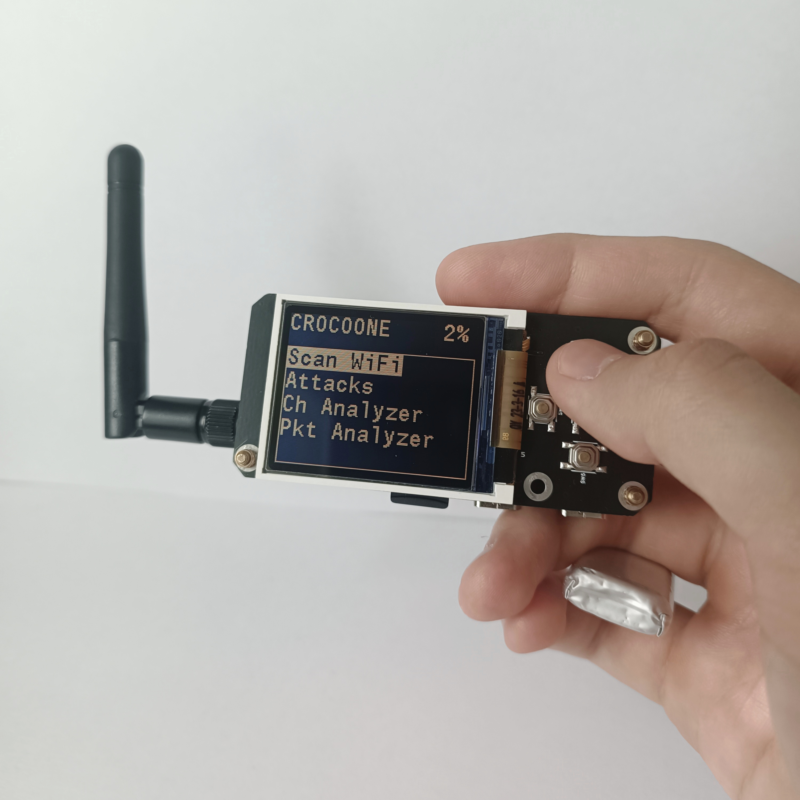
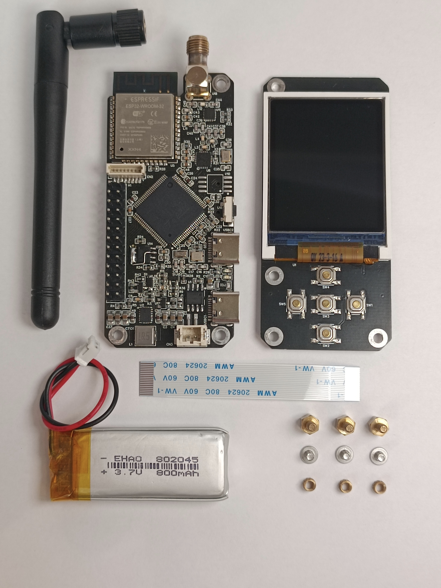

# Crocoone

This project is a compact and self-contained device for analyzing and pentest various wireless communication protocols. At the moment, it mainly implements functions related to Wi-Fi and 2.4Ghz spectrum analysis. 
<p align="center">
    
</p>

## Features
- **PMKID scan and capture**
- **WPA/WPA2 handshake capture** in passive and active modes
- **Deauthentication attack**
- **Beacon attack**
- Formatting captured traffic into **PCAP format**
- Formatting captured handshakes into **HCCAPX format**
- Formatting captured handshakes and PMKIDs into the new **hc22000 file format** added in Hashcat 6.0.
- storing files on an **SD card**
- **scanning Wi-Fi APs**
- **Wi-Fi packets monitor**
- **2.4Ghz channel analyzer**
- **2.4Ghz jammer**

## Hardware

The main hardware features of the project are described here. EasyEDA was used to create circuit diagrams and PCBs. If you need more detailed information about the circuit or the EasyEDA source files, see the "hardware/" folder. This project is based on the STM32H750VBT6 and ESP32-WROOM microcontrollers. STM32 acts as the main microcontroller, and ESP32 is only needed to implement Wi-Fi functions. They communicate with each other via the UART interface. The device consists of two boards, the main and user boards, they are connected to each other by an FPC cable. The device is powered by a 1C 800mAh Li-Po battery, but it is recommended to use a larger capacity battery.

<p align="center">
    
</p>

### main board description

This board implements all the main functionality of the device.

<p align="center">
    
</p>

1. PH 2.0mm 2pin Li-Po battery connector.
2. TP4056 for battery charging. The charging current is set to 1000mAh using a 1.2kOm resistor connected to pin 2 of the chip. The board also contains LEDs connected to the TP4056, indicating the battery charging status.
3. USB C port connected to STM32 (7) (this function has not yet been implemented in the code). Can also be used for battery charging.
4. Power button. You need to hold it for a few seconds to turn on the device. It sends a turn-on signal to the power controller (5), which in turn on the STM32 (7), then the STM32 (7) holds the power controller in the enable state and the button can be released. The device is turned off through the user menu.
5. TPS63020 buck-boost voltage converter is used to convert the battery voltage (3.0V - 4.2V) to a stable 3.3V to power the circuit.
6. The board has a jumper responsible for the TPS63020 power saving mode (see TPS63020 datasheet on page 13). Position 1 - PS OFF, position 2 - PS ON. In my case, this mode is disabled.
7. STM32 is the main microcontroller on the board. Almost all peripherals are connected to it.
8. GPIO pins. Pinout on the picture.
9. SH 1.0mm 8pin connector. Used to connect additional modules built into the case via the SPI interface. It is planned to connect the RFID-RC522 module (this function has not yet been implemented in the code). Pinout on the picture.
10. Place for soldering additional flash memory if necessary (not used). The memory is connected to the STM32 (7) via QSPI.
11. ESP32 is connected only to STM32 (7) and CP2102 (12). It implements all Wi-Fi attacks, scans packets and access points.
12. CP2102 is a USB UART bridge used for programming ESP32. Connected to USB C port (13). 
13. USB C port for ESP32 programming. Can also be used for battery charging.
14. NRF24L01+NA+PA connected to SPI2. It is used to implement such functions as: channel analyzer and jammer. The rest of the time it is in sleep mode.
15. Connector for nrf24l01 antenna. It can be soldered either SMA (as in my case) or IPEX, if you want the antenna hidden in the case.
16. SD card for saving hashes and pcap files. Connected to SDMMC2.
17. 18pin 0.5mm FPC connector. To connect two boards, use a straight FPC cable, about 60mm long.
18. EEPROM memory AT24Cxx for storing user settings and numbers of files that saves on an SD card (16). File numbers are needed to generate unique file names. Connected via I2C1. (you can see a soldered piece of wire on the EEPROM chip. This is because I forgot to connect several pins of the chip to ground at the design stage. At the moment, all the sources are corrected and you will not have to do something like that)
19. The boards use M2.5 fasteners; holes with a diameter of 2.6 mm are provided for them. To connect two boards, use M2.5x5mm spacers and M2.5x4mm screws.

### user board description

This board is only needed for user interaction.

<p align="center">
    
</p>

20. display ST7735 1.8 160x128
21. Control buttons. B1-PD12, B2-PD11, B3-PD10, B4-PD9, B5-PD8.

## How to flash

As mentioned earlier, there are two microcontrollers on the main board: ESP32 ([11](#main-board-description)) and STM32 ([7](#main-board-description)); In order for the device to work correctly, you need to flash first one, then the second. Below are firmware instructions for each controller:

____

**NOTE: During the STM32 firmware process, you must hold the power on button ([4](#main-board-description))**, since the STM32 keeps the TPS63020 ([5](#main-board-description)) power controller turned on, and during the firmware process this is not possible.
For the same reason, it is better to flash STM32 first, **otherwise, while flashing the ESP32, also hold the power on button.**
____

### STM32


All STM32 firmware source files are located in: [**software/STM32**](software/STM32).
For STM32 firmware you will need ST-Link. The firmware process is no different from flashing standard STM32 boards (blue pill, plack pill...). 
Before starting the firmware, install [**drivers for ST-Link**](https://www.st.com/en/development-tools/stsw-link009.html).
Connect your ST-link to GPIO ([8](#main-board-description)) using the following diagram:

| GPIO pin | ST-link pin |
|:----------------:|:--------:|
| 22 (RST)  | RESET |
| 23 (DIO) | SWDIO |
| 24 (CLK) | SWCLK |
| 25 (GND) | GND |
| 26 (3V3) | +3.3V |

If you have Cube IDE setup just copy [**CROCOONE_H750**](software/STM32) folder into your Cube IDE worckspace, import the project, build it and flash the controller.

Otherwise you can use [**ST-Link utility**](https://www.st.com/en/development-tools/stsw-link004.html). In ST-Link utility go to ***Target>Settings...*** and in the ***mode*** tab select the ***connect under reset*** mode. Then go to ***Target>Program...*** and in the window that appears, select the file with the firmware ([**CROCOONE_H750.bin**](software/STM32/CROCOONE_H750) or [**CROCOONE_H750.hex**](software/STM32/CROCOONE_H750)). This completes the firmware process!


### ESP32

All ESP32 firmware source files are located in: [**software/ESP32**](software/ESP32). The process of flashing ESP firmware is no different from flashing the *ESP32 WROOM Devkit board*. First, put the ESP32 into **boot mode** by closing the boot pin to gnd. To do this, connect pins 1 (BOOT) and 2 (GND) of the GPIO with a jumper.

<p align="center">
    
</p>

To flash the ESP firmware, use the USB numbered 13 in the main board description. You may also need a [**driver for the CP2102**](https://www.silabs.com/developers/usb-to-uart-bridge-vcp-drivers).

If you have ESP-IDF setup, just use **idf.py flash**.

Otherwise use [`esptool.py`](https://github.com/espressif/esptool). Use this command:

```
esptool.py -p COM7 -b 115200 --after hard_reset write_flash --flash_mode dio --flash_freq 40m --flash_size detect 0x8000 build/partition_table/partition-table.bin 0x1000 build/bootloader/bootloader.bin 0x10000 build/crocoone.bin
```

After completing the firmware, remove the jumper.

## Used software

This project is currently developed using Cube IDE 1.13.0 with HAL library and ESP-IDF 5.0. **The software may not work on other versions!**. Below are the repositories used to create this project. Separately, I would like to mention the [**ESP32 Wi-Fi Penetration Tool**](https://github.com/risinek/esp32-wifi-penetration-tool/tree/master) project by risinek. A considerable part of the code for implementing Wi-Fi functions on the ESP32 was taken from there. Be sure to check out it.

## Disclaimer
This project was created to study various wireless signals and other protocols in particular Wi-Fi. It is not recommended to use this project to attack Wi-Fi access points to which you do not have access. Before using this project, check the legislation of your country! The author does not bear any responsibility for your actions with this project.